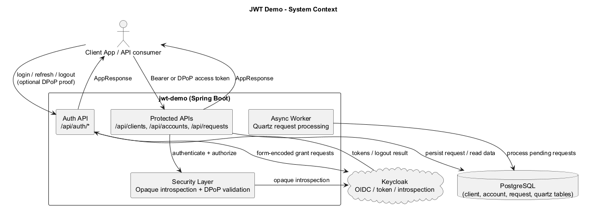
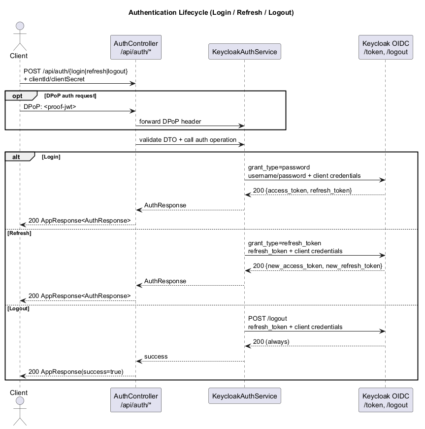
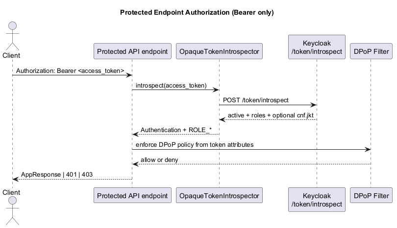
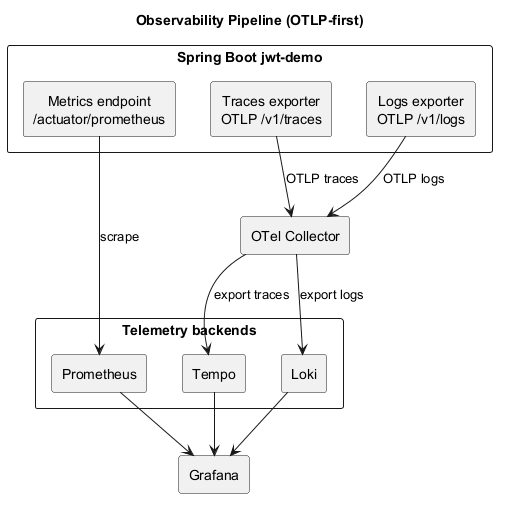

# Architecture

Diagrams are stored in `docs/diagrams/` as PlantUML source and exported PNG files.

## System context

Source: `docs/diagrams/system-context.puml`

## Sequence: Authentication (login / refresh / logout)

Source: `docs/diagrams/sequence-auth-lifecycle.puml`

## Sequence: Protected endpoint authorization (Bearer only)

Source: `docs/diagrams/sequence-protected-authorization.puml`

## Observability pipeline

Source: `docs/diagrams/observability-pipeline.puml`
